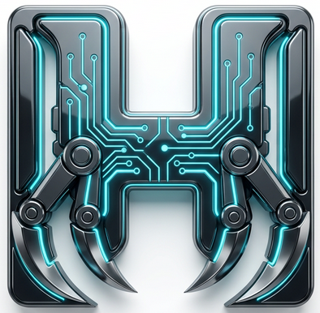

<p align="center">
  
</p>

# 🐾 H-Claw: The WhatsApp AI Power-Suite


**H-Claw** is a premium, personal AI assistant that lives inside your WhatsApp. Built with a "Note to Self" philosophy, it serves as a powerful bridge between your messaging app and cutting-edge AI models, persistent memory, and local system tools.

---

## ✨ Key Features

- **🧠 Multi-Model Intelligence**: Seamlessly switch between **Google Gemini** and **OpenAI GPT** models using simple slash commands.
- **📔 Persistent Memory**: A dedicated long-term memory system (`MEMORY.md`) allowing the AI to recall facts, relationships, and shared media across conversations.
- **🛠️ Extensible Toolset**:
  - **System Access**: Run Bash and PowerShell commands directly from WhatsApp.
  - **Email Management**: Full MAPI/SMTP/IMAP access to send, receive, list, and organize emails across multiple accounts (Gmail, Outlook, Private etc.).
  - **Social Integration**: Telegram client for sending/receiving messages and orchestrating notifications.
  - **Media Generation**: Create DALL-E 3 images and TTS audio on the fly.
  - **Media Analysis**: Advanced Vision and Whisper transcription for images, audio, and documents.
- **🔒 Privacy First**: Strict bot-policy enforcement; H-Claw only responds in self-chats and never initiates external messages unless explicitly instructed.
- **📦 Dynamic Tool Discovery**: Ability for bots to discover and save new tools/scripts to `TOOLS.md` for future use.

---

## 🚀 Installation & Setup

### Prerequisites

- [Node.js](https://nodejs.org/) (v16+)
- A WhatsApp account for the bot
- API Keys for Google Gemini and OpenAI
- (Optional) Telegram Bot Token & Chat ID for notifications

### 1. Clone & Install

```bash
git clone https://github.com/hseeda/10L-H-Claw.git
cd 10L-H-Claw
npm install
```

### 2. Configure Environment

H-Claw uses template files for configuration. Copy the example files and fill in your credentials.

#### API Keys & General Settings
Copy `.env.example` to `.env` and fill in your API keys:

```bash
cp .env.example .env
```

Edit `.env`:

```env
# AI API Keys
GEMINI_API_KEY=your_gemini_key
OPENAI_API_KEY=your_openai_key

# Fallback Order (Provider:Model)
AI_FALLBACK_ORDER=gemini:gemini-3-flash-preview,gemini:gemini-3.1-pro-preview,chatgpt:gpt-4o

# Telegram (Optional)
TELEGRAM_BOT_TOKEN=your_bot_token
TELEGRAM_CHAT_ID=your_chat_id
```

#### Email Configuration (Optional)
Copy `mail_accounts.json.example` to `mail_accounts.json` and add your email accounts:

```bash
cp mail_accounts.json.example mail_accounts.json
```

> [!WARNING]
> Never commit your `.env` or `mail_accounts.json` files. They are included in `.gitignore` by default.

### 3. Running H-Claw

```bash
node app.js
```

Scan the QR code printed in the terminal with your WhatsApp mobile app (Linked Devices) to authenticate.

---

## 🛠️ Tool Classification

H-Claw tools are divided into three distinct categories:

### 1. Built-in Commands (Slash Commands)
These are direct instructions you send to the bot. They are processed locally and do not require AI inference.

| Command | Description |
| :--- | :--- |
| `/help` | Show the help menu with all available commands |
| `/list commands` | Alias for `/help` |
| `/wipe` | Delete all bot messages from the past 24 hours |
| `/wipe tmp` | Delete all files in the `./tmp` directory |
| `/list models` | Show all available AI models |
| `/current model` | Display the model currently in use |
| `/switch model <n>` | Switch the active AI model by its index |
| `/reset model` | Reset to the default AI model |
| `/list contacts [query]` | Search and list your WhatsApp contacts |
| `/print` | Debug: Print internal model variables to console |
| `/stop` | Gracefully shut down the server |

### 2. AI Tools (Hardcoded Capabilities)
These are specialized functions the AI can "choose" to use based on your request. They are defined in `aiTools.js`.

- **Shell Tools**: `execute_bash`, `execute_powershell` (Execute system commands).
- **Memory Tools**: `memory_list`, `memory_add`, `memory_add_media`, `memory_remove`, `memory_edit`, `memory_clear`.
- **File System**: `file_read`, `file_write`, `file_append`, `file_list`.
- **Email**: `mail_send_email`, `mail_list_messages`, `mail_get_message`, etc.
- **WhatsApp Media**: `generate_image` (DALL-E), `generate_audio` (TTS), `whatsapp_read_media` (Vision/Whisper).
- **Telegram**: `telegram_send`, `telegram_list_recent`, `telegram_read_media`.
- **System**: `tool_save` (Saves "Learned Tools" to `TOOLS.md`).

### 3. Learned Tools (Dynamic Recipes)
These are "recipes" or complex workflows stored in `MD/TOOLS.md`. The AI consults this file to learn how to perform non-native tasks.

- **OS Rules**: Context on when to use PowerShell vs Bash.
- **Web Reader**: How to use `lynx` or `links` to scrape websites.
- **PC Alerts**: Commands for native OS notifications (e.g., `BurntToast` for Windows).
- **Custom Workflows**: Any routine the AI has been taught to automate.

---

## 📐 Architecture

H-Claw acts as an intelligent middleware, orchestrating requests between the `whatsapp-web.js` client and various AI provider APIs. It manages context via local Markdown files, ensuring your AI "knows" you better the more you use it.

---

<p align="center">
  <i>"Connecting your digital life through the paw of an AI."</i>
</p>
