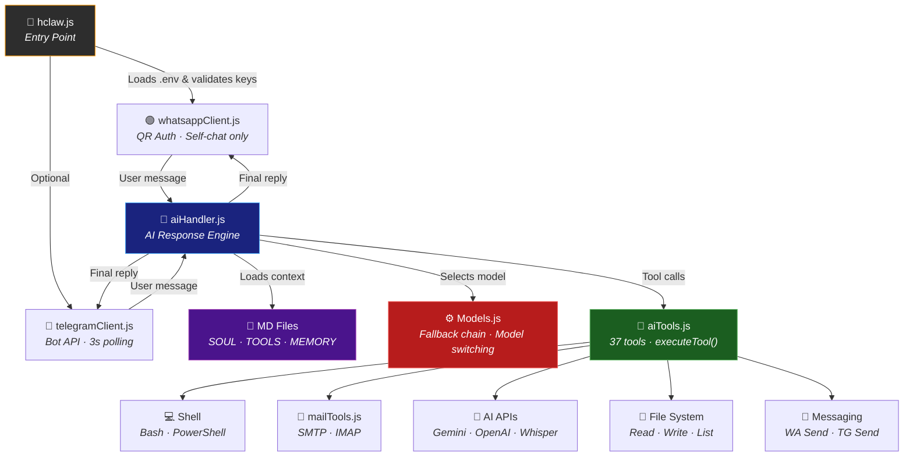

<p align="center">
  
</p>

# H-Claw: Multi-Platform AI Power-Suite


**H-Claw** is a personal AI assistant that lives inside your WhatsApp and Telegram. Built with a "Note to Self" philosophy, it bridges your messaging apps with cutting-edge AI models, persistent memory, system-level tools, email management, and media generation — all from a single chat window.

---

## Architecture Overview



---

## Project Structure

```
10L-H-Claw/
├── hclaw.js                    # Entry point: loads .env, starts clients, handles shutdown
├── src/
│   ├── Models.js               # Model registry, fallback chain, image model config
│   ├── aiHandler.js            # Gemini & OpenAI pipelines, tool-calling loop, token tracking
│   ├── aiTools.js              # 37 tool schemas + executeTool() dispatcher
│   ├── whatsappClient.js       # WhatsApp Web client, message listener, slash commands
│   ├── telegramClient.js       # Telegram Bot API polling, cross-platform bridge
│   ├── mailTools.js            # SMTP/IMAP email management (nodemailer + imapflow)
│   └── serverTools.js          # Graceful shutdown orchestration
├── MD/
│   ├── SOUL.md                 # Bot personality (injected every request)
│   ├── TOOLS.md                # Learned recipes & workflows (injected every request)
│   ├── MEMORY.md               # Persistent user facts (injected every request)
│   └── media/                  # Stored media referenced by MEMORY
├── secrets/
│   ├── .env                    # API keys & config (never committed)
│   ├── .env.example            # Template for .env
│   └── mail_accounts.json      # Email account credentials
├── tmp/                        # Temporary files (generated images, downloads, audio)
├── assets/                     # Logo, banner
└── .wwebjs_auth/               # WhatsApp session persistence (auto-generated)
```

---

## Key Features

### Multi-Model Intelligence

Seamlessly switch between **Google Gemini** and **OpenAI GPT** models. Models are configured as a fallback chain — if one fails, the next activates automatically.

```env
AI_FALLBACK_ORDER=gemini:gemini-3-flash-preview,gemini:gemini-3.1-pro-preview,chatgpt:gpt-4o
```

Image generation supports separate model ordering with multiple providers:

```env
IMAGE_GENERATION_ORDER=openai:dall-e-3;gemini:gemini-2.0-flash-preview-image-generation;imagen:imagen-3.0-generate-002
```

### Persistent Memory

H-Claw maintains a fact-based memory system in `MEMORY.md`, injected into every AI request.

- **Auto-Learning**: The AI decides when to save important info from conversation
- **On-Demand**: Tell the bot to "remember" or "forget" specific details
- **Media Memory**: Save images/files with descriptions for future reference
- **Management**: List, add, edit, remove, and clear facts via tools

### Conversation Persistence

Recent message history is automatically re-injected into the AI context:

- **WhatsApp**: Last 11 messages
- **Telegram**: Last 20 messages per chat

### 37 Built-in AI Tools

The AI can autonomously choose and chain tools based on your request:

| Category | Tools | Capabilities |
|----------|-------|-------------|
| **Shell** | `execute_bash`, `execute_powershell` | Run system commands with 15s timeout |
| **Memory** | `memory_list/add/add_media/remove/edit/clear` | Persistent fact management |
| **Files** | `file_read/write/append/list` | Local filesystem access |
| **WhatsApp** | `whatsapp_send/reply/list_recent/list_contacts/send_media/read_media/download_media` | Full WhatsApp control |
| **Telegram** | `telegram_send/list_recent/delete/send_media/read_media` | Full Telegram control |
| **Email** | `mail_add_account/list_accounts/send_email/list_folders/list_messages/list_messages_all/get_message/delete_message/move_message` | Multi-account SMTP/IMAP |
| **Media** | `generate_image`, `generate_audio` | Image generation (DALL-E/Gemini/Imagen), TTS |
| **System** | `tool_save`, `server_stop` | Save learned workflows, shutdown |

### Media Analysis

- **Images/Documents/PDFs**: Uploaded to Gemini File API for vision analysis. If the active model is OpenAI, Gemini acts as a proxy reader.
- **Audio/Voice Notes**: Transcribed via OpenAI Whisper

### Dynamic Tool Discovery

The bot can learn new capabilities during conversation and save them to `TOOLS.md` for future use. Ask it to create a script, validate it via shell, and persist the recipe.

### Cross-Platform

- **WhatsApp** (primary): Full integration via `whatsapp-web.js` with QR auth
- **Telegram** (secondary): Bot API polling with media support and cross-platform notifications

---

## Slash Commands

Processed locally without AI inference:

| Command | Description |
|---------|-------------|
| `/help` | Show command menu |
| `/wipe` | Delete bot messages from past 24h |
| `/wipe tmp` | Clear temporary files directory |
| `/list models` | Show all available AI models |
| `/current model` | Display active model |
| `/switch model <n>` | Switch AI model by index |
| `/switch image model <n>` | Switch image generation model |
| `/reset model` | Reset to default model |
| `/list contacts [query]` | Search WhatsApp contacts |
| `/stop` | Graceful shutdown |

---

## Installation & Setup

### Prerequisites

- [Node.js](https://nodejs.org/) v16+
- A WhatsApp account
- At least one API key: Google Gemini or OpenAI
- (Optional) Telegram Bot Token & Chat ID

### 1. Clone & Install

```bash
git clone https://github.com/hseeda/10L-H-Claw.git
cd 10L-H-Claw
npm install
```

### 2. Configure Environment

```bash
cp secrets/.env.example secrets/.env
```

Edit `secrets/.env`:

```env
GEMINI_API_KEY=your_gemini_key
OPENAI_API_KEY=your_openai_key
AI_FALLBACK_ORDER=gemini:gemini-3-flash-preview,chatgpt:gpt-4o

# Optional
IMAGE_GENERATION_ORDER=openai:dall-e-3;gemini:imagen-3
TELEGRAM_BOT_TOKEN=your_bot_token
TELEGRAM_CHAT_ID=your_chat_id
```

### 3. WhatsApp Setup

```bash
node hclaw.js
```

1. A QR code appears in the terminal
2. Open WhatsApp → **Linked Devices** → **Link a Device**
3. Scan the QR code — the bot is live

### 4. Telegram Setup (Optional)

1. Message [@BotFather](https://t.me/botfather) to create a bot and get your token
2. Message [@userinfobot](https://t.me/userinfobot) to get your chat ID
3. Add both to your `.env` file

### 5. Email Setup (Optional)

Configure manually in `secrets/mail_accounts.json` or tell the bot: *"Add my Gmail account with these settings..."*

> **Warning**: Never commit `.env` or `mail_accounts.json`. They are in `.gitignore` by default.

---

## Technology Stack

| Component | Library | Purpose |
|-----------|---------|---------|
| WhatsApp | whatsapp-web.js | Web protocol via Puppeteer |
| Telegram | Native Bot API (fetch) | HTTP long-polling |
| Gemini AI | @google/genai | Text, vision, image generation, tool calling |
| OpenAI | openai | GPT models, DALL-E, Whisper, TTS |
| Email | nodemailer, imapflow | SMTP send, IMAP read/manage |
| Shell | child_process | Bash & PowerShell execution |
| Config | dotenv | Environment variables |

---

## Privacy & Security

- **Self-chat only**: H-Claw only responds in your own chat — never initiates external messages unless explicitly instructed
- **Local session**: WhatsApp auth stored locally in `.wwebjs_auth/`
- **No cloud storage**: Memory, tools, and soul files live on your machine
- **Token tracking**: Cumulative token usage logged to console for billing awareness

---

## Roadmap

- **Heartbeat Service**: Proactive reminders and background checks without waiting for user input
- **Persona Switching**: Dynamic personality modes via expanded SOUL.md configuration

---

<p align="center">
  <i>"Connecting your digital life through the paw of an AI."</i>
</p>
