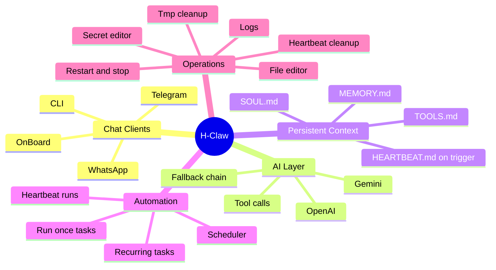
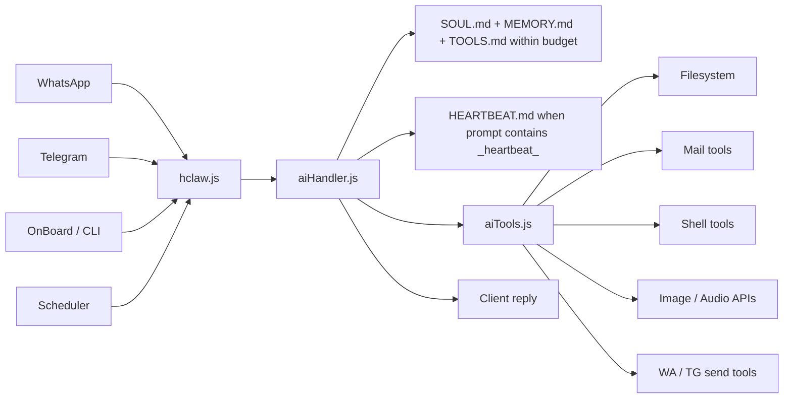
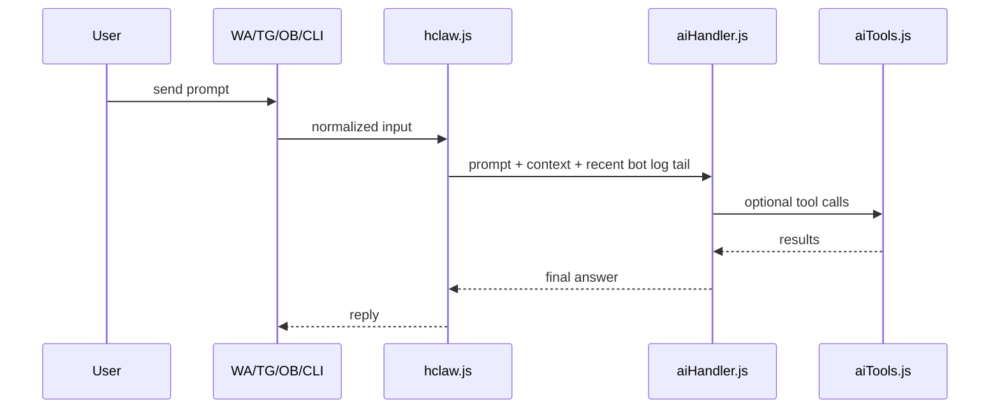
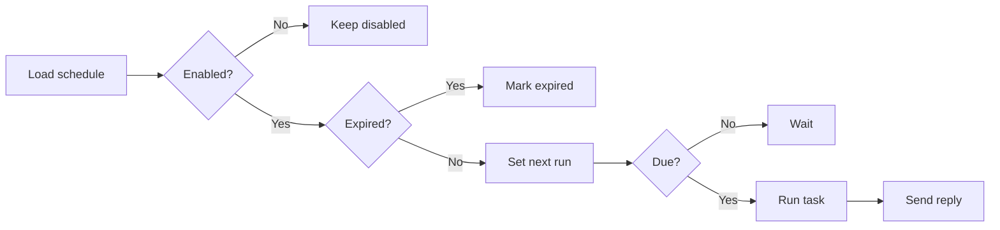
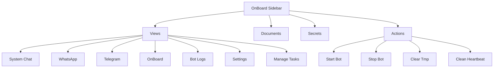

<p align="center">
  
</p>

<h1 align="center">H-Claw</h1>

<p align="center">
  A local-first multi-client AI workspace for WhatsApp, Telegram, OnBoard, schedules, memory, tools, and heartbeat automation.
</p>

<p align="center">
  
</p>

<p align="center">
  
  
  
  
</p>

## What H-Claw Is

H-Claw is a personal AI operating layer that sits on top of your messaging channels and local workspace. It lets you:

- talk to the bot from WhatsApp, Telegram, OnBoard web UI, or the CLI
- route the same tool-using brain across different models
- save persistent facts in `MD/MEMORY.md`
- schedule prompts in `MD/SCHEDULE.json`
- run a bounded heartbeat workflow using `MD/HEARTBEAT.md`
- inspect logs, edit project files, and control the bot from `hclaw-onboard.js`

The design is intentionally file-backed. State lives in readable local files instead of hidden databases.

## Product Tour

### Main Surfaces

| Surface | Purpose | Best For |
|---|---|---|
| `hclaw.js` | main runtime and bot orchestration | day-to-day bot operation |
| `hclaw-onboard.js` | browser dashboard for control, logs, editing, schedules | operations and admin work |
| `hclaw-cli.js` | live terminal companion styled like a coding console | quick local control and monitoring |
| WhatsApp client | primary chat surface | mobile-first personal usage |
| Telegram client | secondary chat surface | fast bot-to-chat automation |

### Feature Map


```mermaid
mindmap
  root((H-Claw))
    Chat Clients
      WhatsApp
      Telegram
      OnBoard
      CLI
    AI Layer
      Gemini
      OpenAI
      Fallback chain
      Tool calls
    Persistent Context
      SOUL.md
      TOOLS.md
      MEMORY.md
      HEARTBEAT.md on trigger
    Automation
      Scheduler
      Run once tasks
      Recurring tasks
      Heartbeat runs
    Operations
      Logs
      File editor
      Secret editor
      Restart and stop
      Tmp cleanup
      Heartbeat cleanup
```

## Architecture

### Runtime Flow


```mermaid
flowchart LR
    WA[WhatsApp] --> CORE[hclaw.js]
    TG[Telegram] --> CORE
    OB[OnBoard / CLI] --> CORE
    SCHED[Scheduler] --> CORE

    CORE --> AI[aiHandler.js]
    AI --> CTX[SOUL.md + MEMORY.md + TOOLS.md within budget]
    AI --> HB[HEARTBEAT.md when prompt contains _heartbeat_]
    AI --> TOOLS[aiTools.js]

    TOOLS --> FS[Filesystem]
    TOOLS --> MAIL[Mail tools]
    TOOLS --> SHELL[Shell tools]
    TOOLS --> MEDIA[Image / Audio APIs]
    TOOLS --> SEND[WA / TG send tools]

    AI --> REPLY[Client reply]
```

## Core Features

### 1. Multi-Client Conversation Layer

H-Claw can receive prompts from multiple surfaces while keeping one operational brain.

- WhatsApp is the most personal and chat-native surface
- Telegram is useful for bot delivery, quick replies, and scheduled routing
- OnBoard is the operations console with logs, editor, settings, and task management
- CLI gives you a live terminal dashboard with local control commands and OnBoard-style input


```mermaid
sequenceDiagram
    participant User
    participant Client as WA/TG/OB/CLI
    participant Core as hclaw.js
    participant AI as aiHandler.js
    participant Tools as aiTools.js

    User->>Client: send prompt
    Client->>Core: normalized input
    Core->>AI: prompt + context + recent bot log tail
    AI->>Tools: optional tool calls
    Tools-->>AI: results
    AI-->>Core: final answer
    Core-->>Client: reply
```

### 2. Model Routing and Fallbacks

H-Claw supports multiple text and image models and can fail over between them.

- text models are selected from `AI_FALLBACK_ORDER`
- image models are selected from `IMAGE_GENERATION_ORDER`
- the active model choice is visible and configurable through OnBoard
- the runtime can switch or reset model selection without changing app code

Example:

```env
AI_FALLBACK_ORDER=gemini:gemini-3-flash-preview,gemini:gemini-3.1-pro-preview,chatgpt:gpt-4o
IMAGE_GENERATION_ORDER=openai:dall-e-3;gemini:gemini-2.0-flash-preview-image-generation;imagen:imagen-3.0-generate-002
```

### 3. Persistent Prompt Context

The bot is not driven by a single hardcoded system prompt. Instead, it composes a context layer from local markdown files plus a recent tail of `logs/bot_log.txt`.

| File | Role |
|---|---|
| `MD/SOUL.md` | personality, style, identity |
| `MD/TOOLS.md` | learned workflows and operating recipes |
| `MD/MEMORY.md` | persistent remembered facts |
| `MD/HEARTBEAT.md` | special bounded instructions for heartbeat-triggered prompts only |
| `logs/bot_log.txt` | newest bot activity injected as recent context |

Normal requests always use:

- `SOUL.md`
- `MEMORY.md`
- `TOOLS.md`
- the latest `BOT_LOG_HISTORY_LIMIT` non-empty lines from `logs/bot_log.txt`

Heartbeat requests additionally inject:

- `HEARTBEAT.md` when the prompt contains `_heartbeat_` in any casing

Prompt construction is budgeted in `src/aiHandler.js` so very large markdown files, messages, and tool outputs are trimmed before they reach the model. This is especially important during tool-calling rounds.

### 4. Memory System

Memory is file-backed and human-readable.

- facts are stored in `MD/MEMORY.md`
- the AI can add, remove, edit, and clear memory via tools
- memory can include media references and descriptions
- because it is markdown, you can also review or edit it directly from OnBoard

This makes memory auditable. You can inspect what the bot “knows” without digging through a database.

### 5. Tool Calling

H-Claw exposes a broad local tool layer through `src/aiTools.js`.

Tool categories include:

- filesystem read/write/list operations
- PowerShell and shell execution
- WhatsApp actions
- Telegram actions
- mail account and message management
- image generation
- audio generation and transcription
- memory management
- server and workflow controls

This means the bot can move beyond plain answering and actually act inside the local workspace.

### 6. Scheduler

Scheduling is powered by `MD/SCHEDULE.json` and runtime logic in `src/scheduleTool.js`.

Each task stores fields such as:

- `pid`
- `start`
- `stop`
- `step_time`
- `prompt`
- `status`
- `next_run_time`
- `issuer_client`
- `issuer_target`

#### Scheduler Behavior

- on bot startup, schedules are loaded and normalized against current time
- expired tasks are marked instead of deleted
- enabled tasks are polled on the wall clock
- when a task becomes due, the scheduler updates `next_run_time` and injects the prompt back into the bot
- replies are routed back to the task’s originating client

#### Run Once

Run-once tasks are represented as:

- `stop = start`
- `step_time = 0m`

#### Scheduling Lifecycle


```mermaid
flowchart LR
    A[Load schedule] --> B{Enabled?}
    B -- No --> X[Keep disabled]
    B -- Yes --> C{Expired?}
    C -- Yes --> Y[Mark expired]
    C -- No --> D[Set next run]
    D --> E{Due?}
    E -- No --> F[Wait]
    E -- Yes --> G[Run task]
    G --> H[Send reply]
```

### 7. Heartbeat Workflow

Heartbeat is a deliberate, bounded automation mode rather than a normal chat feature.

It is controlled by `MD/HEARTBEAT.md` and is intended to:

- analyze `logs/bot_log.txt`
- work inside the `heartbeat/` directory
- generate summaries, audits, helper scripts, and reports there
- avoid broad wandering into unrelated directories when heartbeat constraints say not to

Typical heartbeat output pattern:

```text
heartbeat/
└── YYYY-MM-DD_HHMM/
    ├── summary.txt
    ├── analysis_*.txt
    ├── audit_*.txt
    └── helper_*.js
```

Heartbeat is especially useful for:

- periodic self-review
- operations summaries
- log trend analysis
- bounded proactive maintenance artifacts

### 8. OnBoard Dashboard

`hclaw-onboard.js` is the operations center for H-Claw.

#### What it does

- starts, stops, and restarts the bot
- shows system, bot, WhatsApp, Telegram, and OnBoard logs
- lets you send prompts from the web UI
- switches input routing when you change sidebar conversation views
- manages schedules visually
- edits documents and approved secret files
- previews workspace files, including heartbeat artifacts
- cleans `tmp/` and heartbeat output directories
- includes mobile-friendly layout behavior, a hamburger menu on smaller screens, and compact top-bar controls

#### Why it matters

Without OnBoard, H-Claw is a capable bot runtime.

With OnBoard, H-Claw becomes a manageable local AI workstation.

#### OnBoard View Map


```mermaid
graph TD
    A[OnBoard Sidebar] --> B[Views]
    A --> C[Documents]
    A --> D[Secrets]
    A --> E[Actions]

    B --> B1[System Chat]
    B --> B2[WhatsApp]
    B --> B3[Telegram]
    B --> B4[OnBoard]
    B --> B5[Bot Logs]
    B --> B6[Settings]
    B --> B7[Manage Tasks]

    E --> E1[Start Bot]
    E --> E2[Stop Bot]
    E --> E3[Clear Tmp]
    E --> E4[Clean Heartbeat]
```

### 9. CLI Companion

`hclaw-cli.js` mirrors the operational feel of OnBoard inside a terminal.

It gives you:

- live log viewing
- direct OnBoard-style text input
- local `:` commands for control
- fast return to log view from command panes
- a terminal workflow for users who prefer keyboard-first operation

## Feature Deep Dive

### Messaging Behavior

- bot output is normalized to start with `🐾`
- scheduled injections are logged distinctly
- replies are pushed back to the right client when possible
- Telegram and WhatsApp defaults are handled carefully to avoid ambiguous target routing

### Logging

H-Claw keeps separate logs for different layers:

| Log | Purpose |
|---|---|
| `logs/log.txt` | system/runtime log |
| `logs/bot_log.txt` | bot prompt/reply oriented log |
| `logs/wa_log.txt` | WhatsApp client activity |
| `logs/tg_log.txt` | Telegram client activity |
| `logs/ob_log.txt` | OnBoard events |

Operationally, this separation helps when debugging:

- client connectivity
- scheduler execution
- model/tool behavior
- heartbeat activity

### Safe File Visibility

The dashboard distinguishes between:

- documents
- secrets
- generated heartbeat artifacts

That separation helps keep editing intentional while still making important files accessible.

## Setup

### Prerequisites

- Node.js 18+
- at least one AI provider key
- WhatsApp account for `whatsapp-web.js`
- optional Telegram bot token and chat ID

### Install

```bash
git clone https://github.com/hseeda/10L-H-Claw.git
cd 10L-H-Claw
npm install
```

### Configure Environment

Copy and edit:

```bash
cp secrets/.env.example secrets/.env
```

Core variables in `secrets/.env`:

```env
GEMINI_API_KEY=...
OPENAI_API_KEY=...
AI_FALLBACK_ORDER=gemini:gemini-3-flash-preview,chatgpt:gpt-4o
IMAGE_GENERATION_ORDER=openai:dall-e-3;gemini:gemini-2.0-flash-preview-image-generation
TELEGRAM_BOT_TOKEN=...
TELEGRAM_CHAT_ID=...
```

Runtime tuning in `secrets/.env_bot`:

```env
BOT_LOG_HISTORY_LIMIT=50
MAX_TOOL_CALLS=15
DEFAULT_BOT_MODEL=1
DEFAULT_IMAGE_MODEL=1
```

### Run the Main Bot

```bash
node hclaw.js
```

### Run OnBoard

```bash
node hclaw-onboard.js
```

Then open:

```text
http://localhost:3000
```

If you access OnBoard remotely, put it behind SSH tunneling or a reverse proxy with authentication. The current admin surface is powerful and should not be exposed publicly without protection.

### Run the CLI

```bash
npm run cli
```

## Common Workflows

### Use H-Claw as a Personal Chat Agent

1. Start the bot.
2. Link WhatsApp or enable Telegram.
3. Send prompts from your preferred client.
4. Let the bot use tools when needed.

### Manage Schedules Visually

1. Open OnBoard.
2. Go to `Manage Tasks`.
3. Add or edit tasks.
4. Keep the bot running so runtime statuses and `next_run_time` keep moving.

### Run a Heartbeat

1. Ensure `MD/HEARTBEAT.md` has the workflow you want.
2. Send a prompt containing `heartbeat`.
   Use `_heartbeat_` if you want to guarantee the heartbeat instruction file is injected.
3. Review generated files in `heartbeat/`.

### Edit Core Context

Use OnBoard `Documents` to edit:

- `SOUL.md`
- `TOOLS.md`
- `MEMORY.md`
- `HEARTBEAT.md`
- `SCHEDULE.json`

Use OnBoard `Secrets` to edit:

- `.env`
- `.env.example`
- `.env_bot`
- `mail_accounts.json`
- `mail_accounts.json.example`

## Slash Commands

These are handled locally without needing full model inference.

| Command | Description |
|---|---|
| `/help` | show command help |
| `/wipe` | remove recent bot messages |
| `/wipe tmp` | clear temporary files |
| `/list models` | list available text models |
| `/current model` | show current text model |
| `/switch model <n>` | switch text model |
| `/switch image model <n>` | switch image model |
| `/reset model` | reset to default model |
| `/list contacts [query]` | search WhatsApp contacts |
| `/list schedule` | list stored schedules |
| `/schedule ...` | create a schedule |
| `/delete task <pid>` | delete one schedule |
| `/delete schedule` | delete all schedules |
| `/stop` | stop the bot |

## Prompt and Token Behavior

- The runtime injects `SOUL.md`, `MEMORY.md`, `TOOLS.md`, and optionally `HEARTBEAT.md`.
- The runtime also injects the latest tail of `logs/bot_log.txt`, controlled by `BOT_LOG_HISTORY_LIMIT` in `secrets/.env_bot`.
- Platform chat transcripts are not injected into the model prompt by default.
- Prompt sections are hard-limited in `src/aiHandler.js` so model tool loops do not grow unbounded.
- `MAX_TOOL_CALLS` in `secrets/.env_bot` limits tool-calling rounds per request.

## Security and Operational Notes

- secrets should stay in `secrets/` and remain uncommitted
- WhatsApp auth is stored locally
- memory and tools are local files, so they are inspectable
- heartbeat can be bounded by its own instructions
- scheduler state is persistent because it lives in `MD/SCHEDULE.json`
- OnBoard currently has no built-in authentication layer; secure it before remote exposure

## Why the Design Works

H-Claw is strong because it combines:

- human-readable local state
- multi-client accessibility
- tool-using AI behavior
- simple operational surfaces
- explicit scheduling and heartbeat automation

Instead of hiding important behavior behind opaque internal state, it exposes the working pieces as files and dashboards you can inspect.

## Quick Reference

| Need | Where to look |
|---|---|
| bot runtime | `hclaw.js` |
| web dashboard | `hclaw-onboard.js` |
| terminal dashboard | `hclaw-cli.js` |
| AI orchestration | `src/aiHandler.js` |
| tool execution | `src/aiTools.js` |
| schedules | `MD/SCHEDULE.json` and `src/scheduleTool.js` |
| heartbeat rules | `MD/HEARTBEAT.md` |
| persistent memory | `MD/MEMORY.md` |

<p align="center">
  <i>H-Claw turns local files, messaging clients, and model tools into one inspectable AI control surface.</i>
</p>
